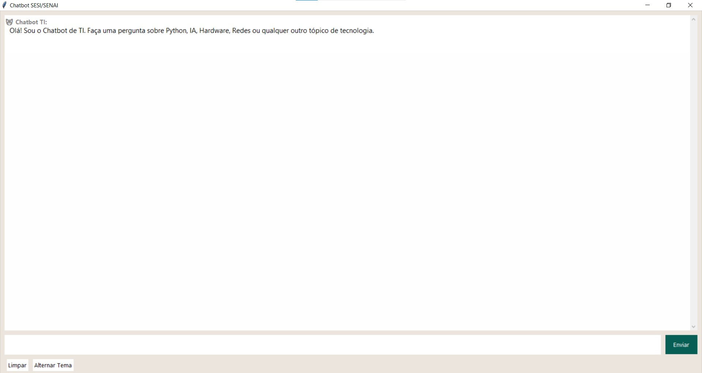
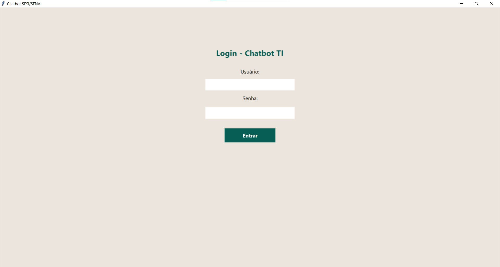
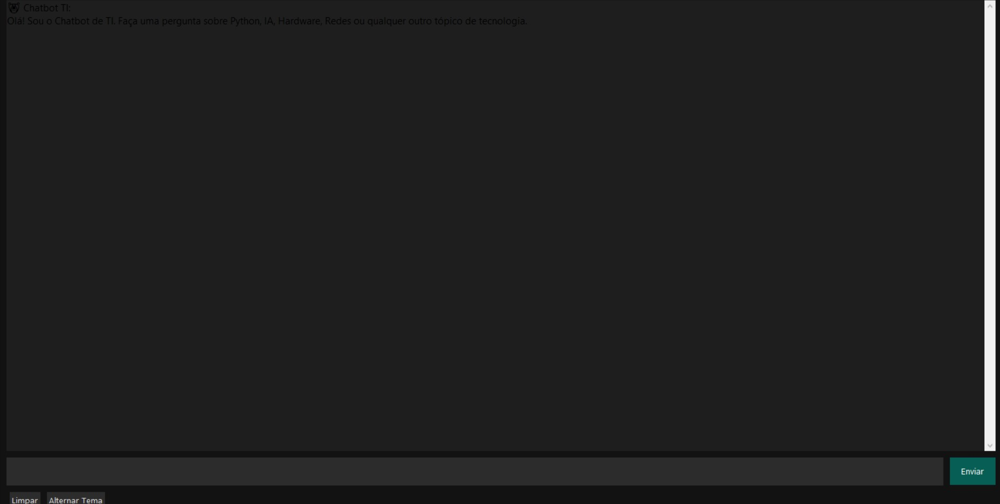

# Chatbot de TI | Assistente Virtual Python

 

> **Aplicação desktop robusta desenvolvida para o curso de Desenvolvimento de Sistemas (SESI/SENAI), simulando um assistente virtual com autenticação, temas dinâmicos e lógica de resposta.**

## Sobre o Projeto

Este projeto é um exercício prático de **Inteligência Artificial e Design de Interface**. O objetivo foi criar um chatbot funcional que operasse localmente, simulando o comportamento de uma IA de suporte técnico.

Diferente de scripts simples de terminal, esta aplicação conta com uma **Interface Gráfica (GUI)** completa construída nativamente com `Tkinter`, focando na experiência do usuário (UX) com troca de temas e feedback visual.

*Interface principal rodando no Modo Claro.*

---

## Funcionalidades Principais

### 1. Sistema de Autenticação
Segurança simulada para acesso ao sistema.
* **Conceitos:** Validação condicional, ocultamento de caracteres (senha).
* **Credenciais:** Usuário: `aluno` | Senha: `123`.

### 2. Lógica de Chat & Delay
O bot não responde instantaneamente, gerando uma sensação mais natural.
* **Conceitos:** `time.sleep` (simulação de raciocínio), Estruturas condicionais aninhadas.
* **Tópicos:** O bot reconhece palavras-chave sobre SQL, Redes, Hardware e Python.

### 3. Dark Mode Engine
Alternância de temas em tempo real sem reiniciar a aplicação.
* **Conceitos:** Manipulação de propriedades de widgets, gestão de estados de UI.
* **Visual:** Ajuste automático de fundo, fonte e caixas de entrada.

---

## Tecnologias e Conceitos Aplicados

### Engenharia de Software
* **Python 3:** Lógica core da aplicação.
* **Tkinter:** Construção da interface gráfica (Janelas, Frames, Entry, Scrollbar).
* **Lógica de Strings:** Tratamento de input do usuário (lower case, strip) para melhor reconhecimento de comandos.

---

## Galeria

  
  

---

# Autor

  

   
  
  <h3>Vinícius Montuani</h3>

  

    <em>Estudante de Desenvolvimento de Sistemas @ SENAI</em>
  

   

  
  

